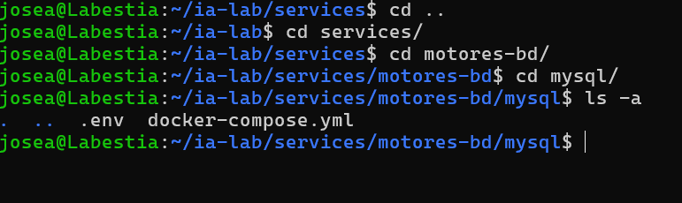
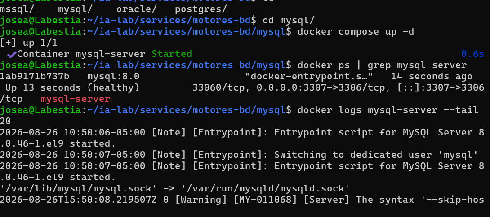
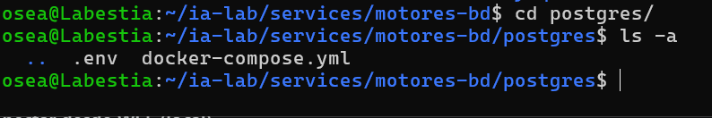
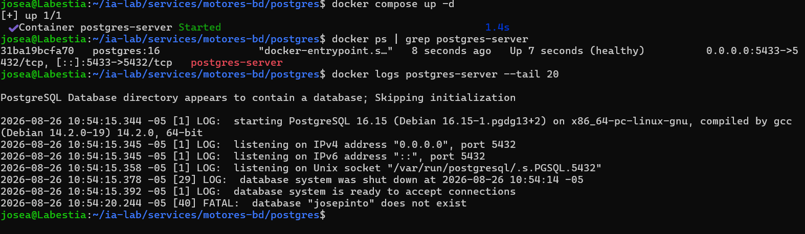
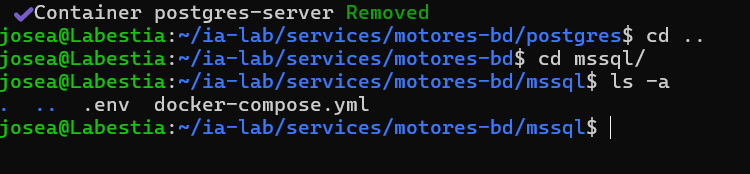
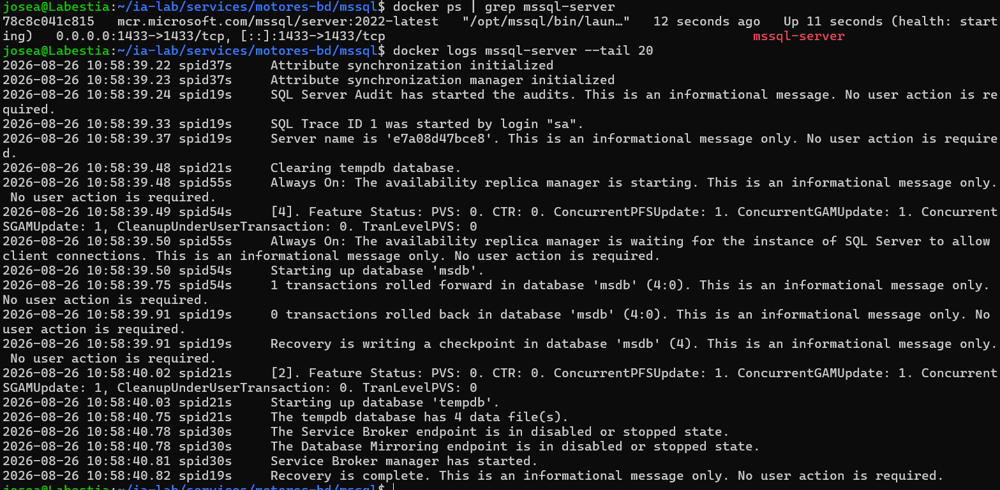
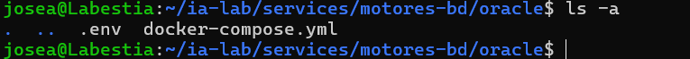

# Semana 1: Configuración de Infraestructura con Docker Compose

## 1. Requisitos Previos

- WSL2 instalado y funcionando
- Docker funcionando dentro de WSL
- Acceso a terminal bash en WSL

Verifica Docker:

```bash
docker --version
docker compose version
```
<p align="center">
  
</p>


---------------------------------------------------------------------------------------------

## 2. Paso 1: Crear Carpetas

Abre tu terminal WSL y ejecuta:

``` bash
mkdir -p ~/ia-lab/services/motores-bd/{mysql,postgres,mssql,oracle}
mkdir -p ~/ia-lab/data/{mysql,postgres,mssql,oracle}
```

Verifica la estructura:
<p align="center">
  
</p>


Si no tienes `tree` instalado,

``` bash
sudo apt install tree
``` 

---------------------------------------------------------------------------------------------

## 3. Paso 2: Crear la Red Docker Compartida

Todos los contenedores compartirán una misma red Docker para comunicarse entre sí:

``` bash
docker network inspect ia-lab-network >/dev/null 2>&1 || docker network create ia-lab-network
```

Verifica que se creó:
<p align="center">
  
</p>


---------------------------------------------------------------------------------------------

## 4. Paso 3: MySQL

### 4.1 Crear el archivo docker-compose.yml

``` bash
cat > ~/ia-lab/services/motores-bd/mysql/docker-compose.yml << 'EOF'
services:
  mysql:
    image: mysql:8.0
    container_name: mysql-server
    restart: unless-stopped
    env_file:
      - .env
    ports:
      - "3307:3306"
    volumes:
      - ../../../data/mysql:/var/lib/mysql
      - /mnt/c/academia/bd:/backups
    command: >
      --character-set-server=utf8mb4
      --collation-server=utf8mb4_unicode_ci
      --bind-address=0.0.0.0
    networks:
      - ia-lab-network
    healthcheck:
      test: ["CMD", "mysqladmin", "ping", "-h", "localhost"]
      interval: 10s
      timeout: 5s
      retries: 5
      start_period: 30s

networks:
  ia-lab-network:
    external: true
EOF
```


### 4.2 Crear el archivo .env

``` bash
TZ=America/Bogota
MYSQL_ROOT_PASSWORD=jose123456
MYSQL_DATABASE=josepinto

EOF
```
<p align="center">
  
</p>


--------------------------------------------------------------------------------

## Conectar desde WSL (local)

```bash
docker exec -it mysql-server mysql -u root -p

```

## Conectar remotamente desde cualquier equipo

Reemplaza `172.21.28.50` por la IP de la maquina WSL:

``` bash
mysql -h 172.21.28.50 -P 3306 -u root -p
```

O con cliente grafico (MySQL Workbench, DBeaver, HeidiSQL): - **Host:** `172.21.28.50` - **Port:** `3306` - **User:** `root` - **Password:** `AlbertoMySQL3306`


### 4.4 Levantar MySQL

```bash
cd ~/ia-lab/services/motores-bd/mysql
docker compose up -d
```

Verificar que está corriendo:

``` bash
docker ps | grep mysql-server
docker logs mysql-server --tail 20

```
<p align="center">
  
</p>


------------------------------------------------------------------------------

## 5. Paso 4: PostgreSQL

### 5.1 Crear docker-compose.yml

``` bash
cat > ~/ia-lab/services/motores-bd/postgres/docker-compose.yml << 'EOF'
services:
  postgres:
    image: postgres:16
    container_name: postgres-server
    restart: unless-stopped
    env_file:
      - .env
    ports:
      - "5433:5432"
    volumes:
      - ../../../data/postgres:/var/lib/postgresql/data
      - /mnt/c/academia/bd:/backups
    networks:
      - ia-lab-network
    healthcheck:
      test: ["CMD-SHELL", "pg_isready -U $$POSTGRES_USER"]
      interval: 10s
      timeout: 5s
      retries: 5
      start_period: 20s

networks:
  ia-lab-network:
    external: true
EOF
```

### 5.2 Crear .env

``` bash
cat > ~/ia-lab/services/motores-bd/postgres/.env << 'EOF'
TZ=America/Bogota
POSTGRES_DB=josepintol
POSTGRES_USER=josepinto
POSTGRES_PASSWORD=jose123456
PGDATA=/var/lib/postgresql/data
EOF

```
<p align="center">
  
</p>

------------------------------------------------------------------------------

## Conectar desde WSL (local)

```bash
docker exec -it postgres-server psql -U josepinto -d josepintol
# Password: jose123456
```


### 5.4 Levantar PostgreSQL

```bash
cd ~/ia-lab/services/motores-bd/postgres
docker compose up -d
```

``` bash
docker ps | grep postgres-server
docker logs postgres-server --tail 20
```
<p align="center">
  
</p>


-----------------------------------------------------------------------------------------------

## 6. Paso 5: SQL Server

### 6.1 Crear docker-compose.yml

``` bash
cat > ~/ia-lab/services/motores-bd/mssql/docker-compose.yml << 'EOF'
services:
  mssql:
    image: mcr.microsoft.com/mssql/server:2022-latest
    container_name: mssql-server
    restart: unless-stopped
    user: root
    env_file:
      - .env
    ports:
      - "1433:1433"
    volumes:
      - ../../../data/mssql:/var/opt/mssql
      - /mnt/c/academia/bd:/backups
    networks:
      - ia-lab-network
    healthcheck:
      test: ["CMD-SHELL", "/opt/mssql-tools18/bin/sqlcmd -S localhost -U sa -P \"$$MSSQL_SA_PASSWORD\" -C -Q 'SELECT 1' || exit 1"]
      interval: 15s
      timeout: 10s
      retries: 6
      start_period: 40s

networks:
  ia-lab-network:
    external: true
EOF]
```

### 6.2 Crear .env

``` bash
cat > ~/ia-lab/services/motores-bd/mssql/.env << 'EOF'
TZ=America/Bogota
ACCEPT_EULA=Y
MSSQL_SA_PASSWORD=Jose123456!
MSSQL_PID=Developer
EOF
```
<p align="center">
  
</p>

-------------------------------------------------------------------------------------------------------------------------------------

## Conectar desde WSL (local)

```bash
docker exec -it mssql-server /opt/mssql-tools18/bin/sqlcmd -S localhost -U sa -P 'Jose123456!' -C
```

## Conectar remotamente desde cualquier equipo


## Variables clave del .env

| Variable            | Descripcion                             |
|---------------------|-----------------------------------------|
| `MSSQL_SA_PASSWORD` | Password del usuario SA (administrador) |
| `MSSQL_PID`         | Edicion de SQL Server (Developer)       |        

### 6.4 Levantar SQL Server

```bash
cd ~/ia-lab/services/motores-bd/mssql
docker compose up -d
```

Verificar que está corriendo:

``` bash
docker ps | grep mssql-server
docker logs mssql-server --tail 20
```
<p align="center">
  
</p>

------------------------------------------------------------------------

## 7. Paso 6: Oracle XE

### 7.1 Crear docker-compose.yml

``` bash
cat > ~/ia-lab/services/motores-bd/oracle/docker-compose.yml << 'EOF'
services:
 oracle:
 image: gvenzl/oracle-xe:21-slim
 container_name: oracle-xe
 restart: unless-stopped
 env_file:
 - .env
 ports:
 - "1521:1521"
 - "8080:8080"
 volumes:
 - ../../../data/oracle:/opt/oracle/oradata
 - /mnt/c/academia/bd:/backups
 networks:
 - ia-lab-network
 healthcheck:
 test: ["CMD", "healthcheck.sh"]
 interval: 15s
 timeout: 10s
 retries: 10
 start_period: 90s
dw2026_documentacion_semana1.md 2026-08-16
networks:
 ia-lab-network:
 external: true
EOF

```

### 7.2 Crear .env

``` bash
cat > ~/ia-lab/services/motores-bd/oracle/.env << 'EOF'
TZ=America/Bogota
ORACLE_PASSWORD=Oracles123456
ORACLE_DATABASE=XE
EOF
```
<p align="center">
  
</p>

--------------------------------------------------------------------------------

## Conectar desde WSL (local)

```bash
docker exec -it oracle-xe sqlplus system/OracleXe1521@XEPDB1
```  

### 7.4 Levantar Oracle

```bash
cd ~/ia-lab/services/motores-bd/oracle
docker compose up -d
```

Verificar que está corriendo:

``` bash
docker ps | grep oracle-xe
docker logs -f oracle-xe
```
<p align="center">
  
</p>


------------------------------------------------------------------------