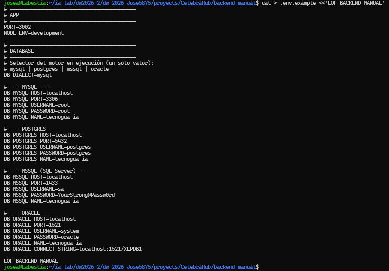

## Bitacora manual de creación del Backend Jose Pinto  

## 1. Crear carpetas padre y permisos
``` bash
/home/josea/ia-lab/dw2026-2/proyects/CelebraHub
josea@Labestia:~/ia-lab/dw2026-2/dw-2026-Jose5875/proyects$ sudo chmod 777 -R CelebraHub/
```
<p align="center">
  
</p>


---------------------------------------------------------------------------------------------

## 2. instalar nest

Ejecutamos el comando para instalar el nestjs y verificar la version:

``` bash
npm install -g @nestjs/cli
nest --version
```

Verifica la estructura:
<p align="center">
  
</p>


---------------------------------------------------------------------------------------------

## 3. Crear proyecto NestJS


``` bash
cd /home/josea/ia-lab/dw2026-2/dw-2026-Jose5875/proyects/CelebraHub/backend_manual
nest new .
cd backend_manual

```


<p align="center">
  
</p>


---------------------------------------------------------------------------------------------

## 4. Crear `.env` mínimo (puerto)

``` bash
cat > .env <<'EOF_BACKEND_MANUAL'
PORT=3002
NODE_ENV=development
EOF_BACKEND_MANUAL

```
<p align="center">
  
</p>


------------------------------------------------------------------------------

## 5. Dependencias de producción


``` bash
npm install @nestjs/config @nestjs/swagger @nestjs/jwt @nestjs/passport @nestjs/mapped-types \
  passport passport-jwt sequelize sequelize-typescript mysql2 pg tedious oracledb \
  class-validator class-transformer bcrypt reflect-metadata express compression helmet
```

<p align="center">
  
</p>


-----------------------------------------------------------------------------------------------

## 6. Dependencias de desarrollo


``` bash

npm install -D @types/bcrypt @types/passport-jwt sequelize-cli

```

<p align="center">
  
</p>

-------------------------------------------------------------------------------------------------------------------------------------

------------------------------------------------------------------------

## 7. Verificar arranque base


``` bash

npm run start:dev
# Ctrl+C cuando veas el log de arranque
curl -s http://localhost:3002 || true
```

<p align="center">
  
</p>

--------------------------------------------------------------------------------


------------------------------------------------------------------------
-----------------------------------------------------

------------------------------------------------------------------------

## 8. Crear árbol base de carpetas


``` bash
mkdir -p src/config/{app,database,environment,logger,swagger}
mkdir -p src/common/{constants,decorators,enums,exceptions,filters,guards,interceptors,interfaces,pipes,types,utils,validators}
mkdir -p src/infrastructure/database/{sequelize,migrations,seeders}
mkdir -p src/infrastructure/logging
mkdir -p src/features/shipping/{companies,contacts,addresses,shipments,packages,tracking-events,couriers,routes,rates,delivery-proofs,invoices}/{application/{dto,mappers,use-cases},domain/{entities,enums,exceptions,interfaces,services,validators},infrastructure/persistence/{models,repositories,migrations,seeders},presentation/http/{controllers,decorators,serializers,swagger},tests}
cat > src/features/shipping/shipping.module.ts <<'EOF_BACKEND'
import { Module } from '@nestjs/common';

@Module({
  imports: [],
  exports: [],
})
export class ShippingModule {}
EOF_BACKEND_MANUAL
```

<p align="center">
  
</p>

--------------------------------------------------------------------------------


------------------------------------------------------------------------
-----------------------------------------------------

------------------------------------------------------------------------

## 9. Crear `.env.example` y actualizar `.env` completo


El `.env` real NO se sube a Git. Usa BD dedicada `enlace_express`.

**Contrato multi-base**

- `DB_DIALECT` = `mysql` | `postgres` | `mssql` | `oracle` (elige qué motor corre).
- MySQL: `DB_MYSQL_HOST`, `DB_MYSQL_PORT`, `DB_MYSQL_USERNAME`, `DB_MYSQL_PASSWORD`, `DB_MYSQL_NAME`.
- PostgreSQL: `DB_POSTGRES_*` (puerto lab 5432).
- SQL Server: `DB_MSSQL_*` (puerto lab 1433, usuario `sa`).
- Oracle: `DB_ORACLE_*` + `DB_ORACLE_CONNECT_STRING` (puerto lab 1521).
- Para cambiar de motor, cambia **solo** `DB_DIALECT`. No uses `DB_HOST` / `DB_USERNAME` genéricos.

```bash
cat > .env.example <<'EOF_BACKEND_MANUAL'
# ==========================================
# APP
# ==========================================
PORT=3002
NODE_ENV=development

# ==========================================
# DATABASE
# ==========================================
# Selector del motor en ejecución (un solo valor):
# mysql | postgres | mssql | oracle
DB_DIALECT=mysql

# --- MYSQL ---
DB_MYSQL_HOST=localhost
DB_MYSQL_PORT=3306
DB_MYSQL_USERNAME=root
DB_MYSQL_PASSWORD=root
DB_MYSQL_NAME=tecnogua_ia

# --- POSTGRES ---
DB_POSTGRES_HOST=localhost
DB_POSTGRES_PORT=5432
DB_POSTGRES_USERNAME=postgres
DB_POSTGRES_PASSWORD=postgres
DB_POSTGRES_NAME=tecnogua_ia

# --- MSSQL (SQL Server) ---
DB_MSSQL_HOST=localhost
DB_MSSQL_PORT=1433
DB_MSSQL_USERNAME=sa
DB_MSSQL_PASSWORD=YourStrong@Passw0rd
DB_MSSQL_NAME=tecnogua_ia

# --- ORACLE ---
DB_ORACLE_HOST=localhost
DB_ORACLE_PORT=1521
DB_ORACLE_USERNAME=system
DB_ORACLE_PASSWORD=oracle
DB_ORACLE_NAME=tecnogua_ia
DB_ORACLE_CONNECT_STRING=localhost:1521/XEPDB1

EOF_BACKEND_MANUAL
```

<p align="center">
  
</p>

--------------------------------------------------------------------------------


------------------------------------------------------------------------
-----------------------------------------------------

------------------------------------------------------------------------

## 10. Interface de entorno

``` bash

mkdir -p src/config/environment
cat > src/config/environment/env.interface.ts <<'EOF_BACKEND_MANUAL'
export enum Environment {
  Development = 'development',
  Production = 'production',
  Test = 'test',
}

export enum DatabaseDialect {
  MySQL = 'mysql',
  Postgres = 'postgres',
  MSSQL = 'mssql',
  Oracle = 'oracle',
}

export interface AppConfig {
  port: number;
  nodeEnv: Environment;
}

export interface DatabaseConfig {
  dialect: DatabaseDialect;
  host: string;
  port: number;
  username: string;
  password: string;
  database: string;
  connectString?: string;
}

export interface EnvironmentConfig {
  app: AppConfig;
  database: DatabaseConfig;
}
EOF_BACKEND_MANUAL
```

<p align="center">
  
</p>

--------------------------------------------------------------------------------


------------------------------------------------------------------------
-----------------------------------------------------

------------------------------------------------------------------------

## 11. Validación de entorno con class-validator


``` bash

mkdir -p src/config/environment
cat > src/config/environment/env.validation.ts <<'EOF_BACKEND_MANUAL'
import { plainToInstance } from 'class-transformer';
import {
  IsEnum,
  IsNumber,
  IsOptional,
  IsString,
  Max,
  Min,
  validateSync,
} from 'class-validator';
import {
  assertActiveDialectCredentials,
  resolveDialectCredentials,
} from './db-env';
import { DatabaseDialect, Environment } from './env.interface';

export class EnvironmentVariables {
  @IsEnum(Environment)
  @IsOptional()
  NODE_ENV: Environment = Environment.Development;

  @IsNumber()
  @Min(0)
  @Max(65535)
  @IsOptional()
  PORT: number = 3002;

  @IsEnum(DatabaseDialect)
  DB_DIALECT: DatabaseDialect;

  @IsString()
  @IsOptional()
  DB_MYSQL_HOST?: string;

  @IsNumber()
  @IsOptional()
  DB_MYSQL_PORT?: number;

  @IsString()
  @IsOptional()
  DB_MYSQL_USERNAME?: string;

  @IsString()
  @IsOptional()
  DB_MYSQL_PASSWORD?: string;

  @IsString()
  @IsOptional()
  DB_MYSQL_NAME?: string;

  @IsString()
  @IsOptional()
  DB_POSTGRES_HOST?: string;

  @IsNumber()
  @IsOptional()
  DB_POSTGRES_PORT?: number;

  @IsString()
  @IsOptional()
  DB_POSTGRES_USERNAME?: string;

  @IsString()
  @IsOptional()
  DB_POSTGRES_PASSWORD?: string;

  @IsString()
  @IsOptional()
  DB_POSTGRES_NAME?: string;

  @IsString()
  @IsOptional()
  DB_MSSQL_HOST?: string;

  @IsNumber()
  @IsOptional()
  DB_MSSQL_PORT?: number;

  @IsString()
  @IsOptional()
  DB_MSSQL_USERNAME?: string;

  @IsString()
  @IsOptional()
  DB_MSSQL_PASSWORD?: string;

  @IsString()
  @IsOptional()
  DB_MSSQL_NAME?: string;

  @IsString()
  @IsOptional()
  DB_ORACLE_HOST?: string;

  @IsNumber()
  @IsOptional()
  DB_ORACLE_PORT?: number;

  @IsString()
  @IsOptional()
  DB_ORACLE_USERNAME?: string;

  @IsString()
  @IsOptional()
  DB_ORACLE_PASSWORD?: string;

  @IsString()
  @IsOptional()
  DB_ORACLE_NAME?: string;

  @IsString()
  @IsOptional()
  DB_ORACLE_CONNECT_STRING?: string;
}

function formatValidationErrors(
  errors: ReturnType<typeof validateSync>,
): string {
  return errors
    .map((error) => {
      const constraints = error.constraints
        ? Object.values(error.constraints).join(', ')
        : 'valor inválido';
      return `${error.property}: ${constraints}`;
    })
    .join('; ');
}

export function validate(config: Record<string, unknown>): EnvironmentVariables {
  const validatedConfig = plainToInstance(EnvironmentVariables, config, {
    enableImplicitConversion: true,
    exposeDefaultValues: true,
  });

  const errors = validateSync(validatedConfig, {
    skipMissingProperties: false,
  });

  if (errors.length > 0) {
    throw new Error(
      `Error de configuración: variable(s) crítica(s) inválida(s) o ausente(s). ${formatValidationErrors(errors)}. Copia .env.example a .env y completa el bloque del motor elegido (DB_DIALECT).`,
    );
  }

  assertActiveDialectCredentials(resolveDialectCredentials(validatedConfig));

  return validatedConfig;
}
EOF_BACKEND_MANUAL
```

<p align="center">
  
</p>

--------------------------------------------------------------------------------


------------------------------------------------------------------------
-----------------------------------------------------

------------------------------------------------------------------------

## 12. Resolver de credenciales por motor


``` bash

mkdir -p src/config/environment
cat > src/config/environment/db-env.ts <<'EOF_BACKEND_MANUAL'
import { DatabaseConfig, DatabaseDialect } from './env.interface';

export const DEFAULT_DB_PORTS: Record<DatabaseDialect, number> = {
  [DatabaseDialect.MySQL]: 3307,
  [DatabaseDialect.Postgres]: 5433,
  [DatabaseDialect.MSSQL]: 1433,
  [DatabaseDialect.Oracle]: 1521,
};

export type DialectEnvSource = {
  DB_DIALECT: DatabaseDialect;
  DB_MYSQL_HOST?: string;
  DB_MYSQL_PORT?: string | number;
  DB_MYSQL_USERNAME?: string;
  DB_MYSQL_PASSWORD?: string;
  DB_MYSQL_NAME?: string;
  DB_POSTGRES_HOST?: string;
  DB_POSTGRES_PORT?: string | number;
  DB_POSTGRES_USERNAME?: string;
  DB_POSTGRES_PASSWORD?: string;
  DB_POSTGRES_NAME?: string;
  DB_MSSQL_HOST?: string;
  DB_MSSQL_PORT?: string | number;
  DB_MSSQL_USERNAME?: string;
  DB_MSSQL_PASSWORD?: string;
  DB_MSSQL_NAME?: string;
  DB_ORACLE_HOST?: string;
  DB_ORACLE_PORT?: string | number;
  DB_ORACLE_USERNAME?: string;
  DB_ORACLE_PASSWORD?: string;
  DB_ORACLE_NAME?: string;
  DB_ORACLE_CONNECT_STRING?: string;
};

function toPort(value: string | number | undefined, fallback: number): number {
  if (typeof value === 'number' && Number.isFinite(value)) {
    return value;
  }
  if (typeof value === 'string' && value.trim() !== '') {
    const parsed = parseInt(value, 10);
    if (Number.isFinite(parsed)) {
      return parsed;
    }
  }
  return fallback;
}

function text(value: string | undefined): string {
  return value?.trim() ?? '';
}

export function resolveDialectCredentials(
  env: DialectEnvSource,
): DatabaseConfig {
  const dialect = env.DB_DIALECT;
  const port = DEFAULT_DB_PORTS[dialect];

  switch (dialect) {
    case DatabaseDialect.MySQL:
      return {
        dialect,
        host: text(env.DB_MYSQL_HOST),
        port: toPort(env.DB_MYSQL_PORT, port),
        username: text(env.DB_MYSQL_USERNAME),
        password: text(env.DB_MYSQL_PASSWORD),
        database: text(env.DB_MYSQL_NAME),
      };
    case DatabaseDialect.Postgres:
      return {
        dialect,
        host: text(env.DB_POSTGRES_HOST),
        port: toPort(env.DB_POSTGRES_PORT, port),
        username: text(env.DB_POSTGRES_USERNAME),
        password: text(env.DB_POSTGRES_PASSWORD),
        database: text(env.DB_POSTGRES_NAME),
      };
    case DatabaseDialect.MSSQL:
      return {
        dialect,
        host: text(env.DB_MSSQL_HOST),
        port: toPort(env.DB_MSSQL_PORT, port),
        username: text(env.DB_MSSQL_USERNAME),
        password: text(env.DB_MSSQL_PASSWORD),
        database: text(env.DB_MSSQL_NAME),
      };
    case DatabaseDialect.Oracle:
      return {
        dialect,
        host: text(env.DB_ORACLE_HOST),
        port: toPort(env.DB_ORACLE_PORT, port),
        username: text(env.DB_ORACLE_USERNAME),
        password: text(env.DB_ORACLE_PASSWORD),
        database: text(env.DB_ORACLE_NAME),
        connectString: text(env.DB_ORACLE_CONNECT_STRING) || undefined,
      };
    default:
      throw new Error(
        `Error de configuración: DB_DIALECT inválido. Use mysql, postgres, mssql u oracle.`,
      );
  }
}

export function assertActiveDialectCredentials(config: DatabaseConfig): void {
  const prefix: Record<DatabaseDialect, string> = {
    [DatabaseDialect.MySQL]: 'DB_MYSQL',
    [DatabaseDialect.Postgres]: 'DB_POSTGRES',
    [DatabaseDialect.MSSQL]: 'DB_MSSQL',
    [DatabaseDialect.Oracle]: 'DB_ORACLE',
  };
  const tag = prefix[config.dialect];
  const missing: string[] = [];

  if (!config.host) missing.push(`${tag}_HOST`);
  if (!config.username) missing.push(`${tag}_USERNAME`);
  if (!config.database) missing.push(`${tag}_NAME`);
  if (config.dialect === DatabaseDialect.Oracle && !config.connectString) {
    missing.push('DB_ORACLE_CONNECT_STRING');
  }

  if (missing.length > 0) {
    throw new Error(
      `Error de configuración: variable(s) crítica(s) inválida(s) o ausente(s) para ${config.dialect}: ${missing.join(', ')}. Completa el bloque de ese motor en .env (no commitees secretos).`,
    );
  }
}
EOF_BACKEND_MANUAL
```

<p align="center">
  
</p>

--------------------------------------------------------------------------------


------------------------------------------------------------------------
-----------------------------------------------------

------------------------------------------------------------------------

## 13. Factory registerAs de entorno


``` bash

mkdir -p src/config/environment
cat > src/config/environment/env.config.ts <<'EOF_BACKEND_MANUAL'
import { registerAs } from '@nestjs/config';
import { resolveDialectCredentials } from './db-env';
import { Environment } from './env.interface';
import { validate } from './env.validation';

export const ENV_CONFIG_NAME = 'environment';

export const envConfig = registerAs(ENV_CONFIG_NAME, () => {
  const validated = validate(process.env);

  return {
    app: {
      port: validated.PORT,
      nodeEnv: validated.NODE_ENV ?? Environment.Development,
    },
    database: resolveDialectCredentials(validated),
  };
});
EOF_BACKEND_MANUAL
```

<p align="center">
  
</p>

--------------------------------------------------------------------------------


------------------------------------------------------------------------
-----------------------------------------------------

------------------------------------------------------------------------

## 14. Constante SEQUELIZE_TOKEN


``` bash

mkdir -p src/common/constants
cat > src/common/constants/database.constants.ts <<'EOF_BACKEND_MANUAL'
export const SEQUELIZE_TOKEN = 'SEQUELIZE';
EOF_BACKEND_MANUAL
```

<p align="center">
  
</p>

--------------------------------------------------------------------------------


------------------------------------------------------------------------
-----------------------------------------------------

------------------------------------------------------------------------

## 15.  Tipos auxiliares de database config


``` bash

mkdir -p src/config/database
cat > src/config/database/database.types.ts <<'EOF_BACKEND_MANUAL'
import { Options as SequelizeOptions } from 'sequelize';

export type DialectOptions =
  | { dialect: 'mysql'; options?: SequelizeOptions }
  | { dialect: 'postgres'; options?: SequelizeOptions }
  | { dialect: 'mssql'; options?: SequelizeOptions }
  | { dialect: 'oracle'; options?: SequelizeOptions };
EOF_BACKEND_MANUAL
```

<p align="center">
  
</p>

--------------------------------------------------------------------------------


------------------------------------------------------------------------
-----------------------------------------------------

------------------------------------------------------------------------

## 16. database.config.ts


``` bash

mkdir -p src/config/database
cat > src/config/database/database.config.ts <<'EOF_BACKEND_MANUAL'
import { registerAs } from '@nestjs/config';
import { resolveDialectCredentials } from '../environment/db-env';
import { DatabaseDialect } from '../environment/env.interface';

export const DATABASE_CONFIG_NAME = 'database';

const dialectModuleMap: Record<DatabaseDialect, string> = {
  [DatabaseDialect.MySQL]: 'mysql2',
  [DatabaseDialect.Postgres]: 'pg',
  [DatabaseDialect.MSSQL]: 'tedious',
  [DatabaseDialect.Oracle]: 'oracledb',
};

export const databaseConfig = registerAs(DATABASE_CONFIG_NAME, () => {
  const dialect =
    (process.env.DB_DIALECT as DatabaseDialect) || DatabaseDialect.MySQL;
  const credentials = resolveDialectCredentials({
    DB_DIALECT: dialect,
    ...process.env,
  });

  return {
    ...credentials,
    dialectModulePath: dialectModuleMap[dialect],
    autoLoadModels: true,
    synchronize: process.env.NODE_ENV !== 'production',
    logging: process.env.NODE_ENV === 'development' ? console.log : false,
  };
});
EOF_BACKEND_MANUAL
```

<p align="center">
  
</p>

--------------------------------------------------------------------------------


------------------------------------------------------------------------
-----------------------------------------------------

------------------------------------------------------------------------

## 17. database.module.ts / providerss

``` bash
mkdir -p src/config/database
cat > src/config/database/database.module.ts <<'EOF_BACKEND_MANUAL'
import { Module } from '@nestjs/common';
import { ConfigModule } from '@nestjs/config';
import { databaseConfig } from './database.config';

@Module({
  imports: [ConfigModule.forFeature(databaseConfig)],
  exports: [ConfigModule],
})
export class DatabaseConfigModule {}
EOF_BACKEND_MANUAL
```

<p align="center">
  
</p>

--------------------------------------------------------------------------------


------------------------------------------------------------------------
-----------------------------------------------------

------------------------------------------------------------------------

## 18. database.providers.ts


``` bash
mkdir -p src/config/database
cat > src/config/database/database.providers.ts <<'EOF_BACKEND'
export const DATABASE_PROVIDERS = [];
EOF_BACKEND
```

<p align="center">
  
</p>

--------------------------------------------------------------------------------


------------------------------------------------------------------------
-----------------------------------------------------

------------------------------------------------------------------------

## 19. Opciones Sequelize por dialecto


``` bash

mkdir -p src/infrastructure/database/sequelize
cat > src/infrastructure/database/sequelize/sequelize.options.ts <<'EOF_BACKEND_IA'
import { SequelizeOptions } from 'sequelize-typescript';
import { resolveDialectCredentials } from '../../../config/environment/db-env';
import { DatabaseDialect } from '../../../config/environment/env.interface';

export function getSequelizeOptions(
  dialect: DatabaseDialect,
): Partial<SequelizeOptions> {
  const credentials = resolveDialectCredentials({
    DB_DIALECT: dialect,
    ...process.env,
  });

  const base: SequelizeOptions = {
    dialect: dialect as SequelizeOptions['dialect'],
    host: credentials.host,
    port: credentials.port,
    username: credentials.username,
    password: credentials.password,
    database: credentials.database,
    logging: process.env.NODE_ENV === 'development' ? console.log : false,
    define: {
      underscored: false,
      freezeTableName: true,
    },
  };

  switch (dialect) {
    case DatabaseDialect.MSSQL:
      return {
        ...base,
        dialectOptions: {
          options: {
            encrypt: true,
            trustServerCertificate: true,
          },
        },
      };
    case DatabaseDialect.Oracle:
      return {
        ...base,
        dialectOptions: {
          connectString: credentials.connectString,
        },
      };
    default:
      return base;
  }
}
EOF_BACKEND_IA
```

<p align="center">
  
</p>

--------------------------------------------------------------------------------


------------------------------------------------------------------------
-----------------------------------------------------

------------------------------------------------------------------------

## 20.  Factory Sequelize (sin modelos aún)


``` bash
mkdir -p src/infrastructure/database/sequelize
cat > src/infrastructure/database/sequelize/sequelize.factory.ts <<'EOF_BACKEND_IA'
import { Sequelize } from 'sequelize-typescript';
import { DatabaseDialect } from '../../../config/environment/env.interface';
import { getSequelizeOptions } from './sequelize.options';


export const ALL_MODELS = [
  // (aún sin modelos — se agregan por feature)
];

export async function createSequelizeInstance(
  dialect: DatabaseDialect,
): Promise<Sequelize> {
  const options = getSequelizeOptions(dialect);

  let dialectModule: any;

  switch (dialect) {
    case DatabaseDialect.MySQL:
      dialectModule = require('mysql2');
      break;
    case DatabaseDialect.Postgres:
      dialectModule = require('pg');
      break;
    case DatabaseDialect.MSSQL:
      dialectModule = require('tedious');
      break;
    case DatabaseDialect.Oracle:
      dialectModule = require('oracledb');
      break;
    default:
      throw new Error(`Dialecto no soportado: ${dialect}`);
  }

  const sequelize = new Sequelize({
    ...options,
    dialectModule,
    models: ALL_MODELS,
  } as any);

  try {
    await sequelize.authenticate();
    console.log(`✅ Conexión exitosa a ${dialect.toUpperCase()}`);
  } catch (error: any) {
    console.error(
      `❌ Error conectando a ${dialect.toUpperCase()}:`,
      error.message,
    );
    throw error;
  }

  if (process.env.NODE_ENV !== 'production') {
    await sequelize.sync({ alter: false });
    console.log('✅ Tablas sincronizadas');
  }

  return sequelize;
}
EOF_BACKEND_IA
```

<p align="center">
  
</p>

--------------------------------------------------------------------------------


------------------------------------------------------------------------
-----------------------------------------------------

------------------------------------------------------------------------

## 21. DatabaseSeederService (sin seeders aún)


``` bash
mkdir -p src/infrastructure/database/seeders
cat > src/infrastructure/database/seeders/database-seeder.service.ts <<'EOF_BACKEND_IA'
import { Injectable, Logger, OnModuleInit } from '@nestjs/common';


/**
 * Ejecuta seeders en orden de dependencias.
 * Solo en entornos no productivos.
 */
@Injectable()
export class DatabaseSeederService implements OnModuleInit {
  private readonly logger = new Logger(DatabaseSeederService.name);

  async onModuleInit(): Promise<void> {
    if (process.env.NODE_ENV === 'production') {
      return;
    }

    try {
      // sin seeders aún
      this.logger.log('✅ Seeders ejecutados');
    } catch (error: any) {
      this.logger.error(`❌ Error en seeders: ${error.message}`, error.stack);
      throw error;
    }
  }
}
EOF_BACKEND_IA
```

<p align="center">
  
</p>

--------------------------------------------------------------------------------


------------------------------------------------------------------------
-----------------------------------------------------

------------------------------------------------------------------------

## 22. Módulo global Sequelize

``` bash
mkdir -p src/infrastructure/database/sequelize
cat > src/infrastructure/database/sequelize/sequelize.module.ts <<'EOF_BACKEND_IA'
import { Module, Global } from '@nestjs/common';
import { ConfigService } from '@nestjs/config';
import { Sequelize } from 'sequelize-typescript';
import { DatabaseDialect } from '../../../config/environment/env.interface';
import { SEQUELIZE_TOKEN } from '../../../common/constants/database.constants';
import { createSequelizeInstance } from './sequelize.factory';
import { DatabaseSeederService } from '../seeders/database-seeder.service';

@Global()
@Module({
  providers: [
    {
      provide: SEQUELIZE_TOKEN,
      useFactory: async (configService: ConfigService): Promise<Sequelize> => {
        const dialect = configService.get<DatabaseDialect>(
          'environment.database.dialect',
          DatabaseDialect.MySQL,
        );
        return createSequelizeInstance(dialect);
      },
      inject: [ConfigService],
    },
    DatabaseSeederService,
  ],
  exports: [SEQUELIZE_TOKEN],
})
export class SequelizeDatabaseModule {}
EOF_BACKEND_IA
```

<p align="center">
  
</p>

--------------------------------------------------------------------------------


------------------------------------------------------------------------
-----------------------------------------------------

------------------------------------------------------------------------

## 23. config/app/app.constants.ts


``` bash

mkdir -p src/config/app
cat > src/config/app/app.constants.ts <<'EOF_BACKEND_IA'
export const APP_CONFIG_NAME = 'app';

export const APP_DEFAULTS = {
  PORT: 3000,
  NODE_ENV: 'development',
};
EOF_BACKEND_IA
```

<p align="center">
  
</p>

--------------------------------------------------------------------------------


------------------------------------------------------------------------
-----------------------------------------------------

------------------------------------------------------------------------

## 24. config/app/app.constants.ts


``` bash

mkdir -p src/config/app
cat > src/config/app/app.config.ts <<'EOF_BACKEND_IA'
import { registerAs } from '@nestjs/config';
import { APP_CONFIG_NAME, APP_DEFAULTS } from './app.constants';
import { Environment } from '../environment/env.interface';

export const appConfig = registerAs(APP_CONFIG_NAME, () => ({
  port: parseInt(process.env.PORT || String(APP_DEFAULTS.PORT), 10),
  nodeEnv: (process.env.NODE_ENV as Environment) || APP_DEFAULTS.NODE_ENV,
}));
EOF_BACKEND_IA
```

<p align="center">
  
</p>

--------------------------------------------------------------------------------


------------------------------------------------------------------------
-----------------------------------------------------

------------------------------------------------------------------------

## 25. config/logger/logger.config.ts


``` bash

mkdir -p src/config/logger
cat > src/config/logger/logger.config.ts <<'EOF_BACKEND_IA'
import { LogLevel } from '@nestjs/common';

export function getLoggerConfig(): { logLevels: LogLevel[] } {
  const isDev = process.env.NODE_ENV === 'development';

  return {
    logLevels: isDev
      ? ['log', 'error', 'warn', 'debug', 'verbose', 'fatal']
      : ['log', 'error', 'warn'],
  };
}
EOF_BACKEND_IA
```

<p align="center">
  
</p>

--------------------------------------------------------------------------------


------------------------------------------------------------------------
------------------------------------------------------------------------

## 26. config/logger/logger.module.ts


``` bash
mkdir -p src/config/logger
cat > src/config/logger/logger.module.ts <<'EOF_BACKEND_IA'
import { Module, Global, Logger } from '@nestjs/common';

@Global()
@Module({
  providers: [Logger],
  exports: [Logger],
})
export class LoggerModule {}
EOF_BACKEND_IA
```

<p align="center">
  
</p>

--------------------------------------------------------------------------------


------------------------------------------------------------------------
v------------------------------------------------------------------------

## 27.  config/swagger/swagger.constants.ts


``` bash
mkdir -p src/config/swagger
cat > src/config/swagger/swagger.constants.ts <<'EOF_BACKEND_IA'
export const SWAGGER_TITLE = 'EnlaceExpress API';
export const SWAGGER_DESCRIPTION =
  'API de mensajería corporativa EnlaceExpress: envíos, tracking, tarifas y facturación (Clean Architecture / DDD sobre NestJS + Sequelize, multi-motor)';
export const SWAGGER_VERSION = '1.0';
export const SWAGGER_PATH = 'api/docs';
EOF_BACKEND_IA
```

<p align="center">
  
</p>

--------------------------------------------------------------------------------


------------------------------------------------------------------------
v------------------------------------------------------------------------

## 28. config/swagger/swagger.config.ts


``` bash
mkdir -p src/config/swagger
cat > src/config/swagger/swagger.config.ts <<'EOF_BACKEND_IA'
import { INestApplication } from '@nestjs/common';
import { DocumentBuilder, SwaggerModule } from '@nestjs/swagger';
import {
  SWAGGER_DESCRIPTION,
  SWAGGER_PATH,
  SWAGGER_TITLE,
  SWAGGER_VERSION,
} from './swagger.constants';

export function setupSwagger(app: INestApplication): void {
  const config = new DocumentBuilder()
    .setTitle(SWAGGER_TITLE)
    .setDescription(SWAGGER_DESCRIPTION)
    .setVersion(SWAGGER_VERSION)
    .build();

  const document = SwaggerModule.createDocument(app, config);
  SwaggerModule.setup(SWAGGER_PATH, app, document);
}
EOF_BACKEND_IA
```

<p align="center">
  
</p>

--------------------------------------------------------------------------------


------------------------------------------------------------------------
v------------------------------------------------------------------------

## 29. common/enums/status.enum.ts


``` bash
mkdir -p src/common/enums
cat > src/common/enums/status.enum.ts <<'EOF_BACKEND_IA'
export enum Status {
  ACTIVE = 'ACTIVE',
  INACTIVE = 'INACTIVE',
}
EOF_BACKEND_IA
```

<p align="center">
  
</p>

--------------------------------------------------------------------------------


------------------------------------------------------------------------
v------------------------------------------------------------------------

## 30. common/enums/http-method.enum.ts

``` bash
mkdir -p src/common/enums
cat > src/common/enums/http-method.enum.ts <<'EOF_BACKEND_IA'
export enum HttpMethod {
  GET = 'GET',
  POST = 'POST',
  PUT = 'PUT',
  PATCH = 'PATCH',
  DELETE = 'DELETE',
}
EOF_BACKEND_IA
```

<p align="center">
  
</p>

--------------------------------------------------------------------------------


------------------------------------------------------------------------
v------------------------------------------------------------------------

## 31. common/enums/sort-order.enum.ts


``` bash
mkdir -p src/common/enums
cat > src/common/enums/sort-order.enum.ts <<'EOF_BACKEND_IA'
export enum SortOrder {
  ASC = 'ASC',
  DESC = 'DESC',
}
EOF_BACKEND_IA
```

<p align="center">
  
</p>

--------------------------------------------------------------------------------


------------------------------------------------------------------------
v------------------------------------------------------------------------

## 32. common/constants/app.constants.ts


``` bash

mkdir -p src/common/constants
cat > src/common/constants/app.constants.ts <<'EOF_BACKEND_IA'
export const APP_NAME = 'CelebraHub_api';
export const GLOBAL_PREFIX = 'api';
EOF_BACKEND_IA
```

<p align="center">
  
</p>

--------------------------------------------------------------------------------


------------------------------------------------------------------------
v------------------------------------------------------------------------

## 33. common/constants/pagination.constants.ts


``` bash

mkdir -p src/common/constants
cat > src/common/constants/pagination.constants.ts <<'EOF_BACKEND_IA'
export const DEFAULT_PAGE = 1;
export const DEFAULT_LIMIT = 10;
export const MAX_LIMIT = 100;
EOF_BACKEND_IA
```

<p align="center">
  
</p>

--------------------------------------------------------------------------------


------------------------------------------------------------------------
v------------------------------------------------------------------------

## 34. common/exceptions/application.exception.ts


``` bash
mkdir -p src/common/exceptions
cat > src/common/exceptions/application.exception.ts <<'EOF_BACKEND_IA'
export class ApplicationException extends Error {
  public readonly timestamp: string;

  constructor(
    public readonly message: string,
    public readonly statusCode: number = 500,
  ) {
    super(message);
    this.timestamp = new Date().toISOString();
    Error.captureStackTrace(this, this.constructor);
  }
}
EOF_BACKEND_IA
```

<p align="center">
  
</p>

--------------------------------------------------------------------------------


------------------------------------------------------------------------
------------------------------------------------------------------------

## 35. common/exceptions/domain.exception.ts


``` bash
mkdir -p src/common/exceptions
cat > src/common/exceptions/domain.exception.ts <<'EOF_BACKEND_IA'
import { ApplicationException } from './application.exception';

export class DomainException extends ApplicationException {
  constructor(message: string) {
    super(message, 400);
  }
}
EOF_BACKEND_IA
```

<p align="center">
  
</p>

--------------------------------------------------------------------------------


------------------------------------------------------------------------
v------------------------------------------------------------------------

## 36. common/exceptions/entity-not-found.exception.ts


``` bash
mkdir -p src/common/exceptions
cat > src/common/exceptions/entity-not-found.exception.ts <<'EOF_BACKEND_IA'
import { ApplicationException } from './application.exception';

export class EntityNotFoundException extends ApplicationException {
  constructor(entityName: string, identifier: string | number) {
    super(`${entityName} con ID ${identifier} no encontrado`, 404);
  }
}
EOF_BACKEND_IA
```

<p align="center">
  
</p>

--------------------------------------------------------------------------------


------------------------------------------------------------------------
v------------------------------------------------------------------------

## 37. common/exceptions/validation.exception.ts


``` bash
mkdir -p src/common/exceptions
cat > src/common/exceptions/validation.exception.ts <<'EOF_BACKEND_IA'
import { ApplicationException } from './application.exception';

export class ValidationException extends ApplicationException {
  constructor(message: string = 'Error de validación') {
    super(message, 422);
  }
}
EOF_BACKEND_IA
```

<p align="center">
  
</p>

--------------------------------------------------------------------------------


------------------------------------------------------------------------
v------------------------------------------------------------------------

## 38. common/filters/global-exception.filter.ts


``` bash
mkdir -p src/common/filters
cat > src/common/filters/global-exception.filter.ts <<'EOF_BACKEND_IA'
import {
  ExceptionFilter,
  Catch,
  ArgumentsHost,
  HttpException,
  HttpStatus,
} from '@nestjs/common';
import { Request, Response } from 'express';
import { ApplicationException } from '../exceptions/application.exception';

@Catch()
export class GlobalExceptionFilter implements ExceptionFilter {
  catch(exception: unknown, host: ArgumentsHost): void {
    const ctx = host.switchToHttp();
    const response = ctx.getResponse<Response>();
    const request = ctx.getRequest<Request>();

    let status = HttpStatus.INTERNAL_SERVER_ERROR;
    let message: string | string[] = 'Error interno del servidor';

    if (exception instanceof ApplicationException) {
      status = exception.statusCode;
      message = exception.message;
    } else if (exception instanceof HttpException) {
      status = exception.getStatus();
      const res = exception.getResponse();
      message = typeof res === 'string' ? res : (res as any).message;
    }

    response.status(status).json({
      statusCode: status,
      message,
      timestamp: new Date().toISOString(),
      path: request.url,
    });
  }
}
EOF_BACKEND_IA
```

<p align="center">
  
</p>

--------------------------------------------------------------------------------


------------------------------------------------------------------------
v------------------------------------------------------------------------

## 39. common/filters/sequelize-exception.filter.ts


``` bash
mkdir -p src/common/filters
cat > src/common/filters/sequelize-exception.filter.ts <<'EOF_BACKEND_IA'
import { ExceptionFilter, Catch, ArgumentsHost } from '@nestjs/common';
import { Response } from 'express';

@Catch()
export class SequelizeExceptionFilter implements ExceptionFilter {
  catch(exception: any, host: ArgumentsHost): void {
    const ctx = host.switchToHttp();
    const response = ctx.getResponse<Response>();

    const sequelizeErrors = [
      'SequelizeUniqueConstraintError',
      'SequelizeForeignKeyConstraintError',
      'SequelizeConnectionError',
      'SequelizeValidationError',
      'SequelizeDatabaseError',
    ];

    if (!exception?.name || !sequelizeErrors.includes(exception.name)) {
      throw exception;
    }

    let status = 500;
    let message = 'Error de base de datos';

    if (exception.name === 'SequelizeUniqueConstraintError') {
      status = 409;
      message = 'El recurso ya existe (violación de unicidad)';
    } else if (exception.name === 'SequelizeForeignKeyConstraintError') {
      status = 400;
      message = 'Violación de clave foránea';
    } else if (exception.name === 'SequelizeConnectionError') {
      status = 503;
      message = 'No se pudo conectar a la base de datos';
    } else if (exception.name === 'SequelizeValidationError') {
      status = 422;
      message = exception.message || 'Error de validación en base de datos';
    }

    response.status(status).json({
      statusCode: status,
      message,
      timestamp: new Date().toISOString(),
    });
  }
}
EOF_BACKEND_IA
```

<p align="center">
  
</p>

--------------------------------------------------------------------------------


------------------------------------------------------------------------
v------------------------------------------------------------------------

## 40. common/interceptors/response.interceptor.ts


``` bash
mkdir -p src/common/interceptors
cat > src/common/interceptors/response.interceptor.ts <<'EOF_BACKEND_IA'
import {
  Injectable,
  NestInterceptor,
  ExecutionContext,
  CallHandler,
} from '@nestjs/common';
import { Observable } from 'rxjs';
import { map } from 'rxjs/operators';

export interface ApiResponse<T> {
  statusCode: number;
  message: string;
  data: T;
  timestamp: string;
}

@Injectable()
export class ResponseInterceptor<T>
  implements NestInterceptor<T, ApiResponse<T>>
{
  intercept(
    context: ExecutionContext,
    next: CallHandler,
  ): Observable<ApiResponse<T>> {
    const response = context.switchToHttp().getResponse();
    const statusCode = response.statusCode;

    return next.handle().pipe(
      map((data) => ({
        statusCode,
        message: 'Operación exitosa',
        data,
        timestamp: new Date().toISOString(),
      })),
    );
  }
}
EOF_BACKEND_IA
```

<p align="center">
  
</p>

--------------------------------------------------------------------------------


------------------------------------------------------------------------
v------------------------------------------------------------------------

## 41. common/interceptors/logging.interceptor.ts


``` bash
mkdir -p src/common/interceptors
cat > src/common/interceptors/logging.interceptor.ts <<'EOF_BACKEND_IA'
import {
  Injectable,
  NestInterceptor,
  ExecutionContext,
  CallHandler,
  Logger,
} from '@nestjs/common';
import { Observable } from 'rxjs';
import { tap } from 'rxjs/operators';

@Injectable()
export class LoggingInterceptor implements NestInterceptor {
  private readonly logger = new Logger('HTTP');

  intercept(context: ExecutionContext, next: CallHandler): Observable<any> {
    const req = context.switchToHttp().getRequest();
    const { method, url } = req;
    const now = Date.now();

    return next.handle().pipe(
      tap(() => {
        const res = context.switchToHttp().getResponse();
        const delay = Date.now() - now;
        this.logger.log(`${method} ${url} ${res.statusCode} - ${delay}ms`);
      }),
    );
  }
}
EOF_BACKEND_IA
```

<p align="center">
  
</p>

--------------------------------------------------------------------------------


------------------------------------------------------------------------
v------------------------------------------------------------------------

## 42. common/interceptors/timeout.interceptor.ts


``` bash
mkdir -p src/common/interceptors
cat > src/common/interceptors/timeout.interceptor.ts <<'EOF_BACKEND_IA'
import {
  Injectable,
  NestInterceptor,
  ExecutionContext,
  CallHandler,
  RequestTimeoutException,
} from '@nestjs/common';
import { Observable, throwError, TimeoutError } from 'rxjs';
import { catchError, timeout } from 'rxjs/operators';

@Injectable()
export class TimeoutInterceptor implements NestInterceptor {
  intercept(context: ExecutionContext, next: CallHandler): Observable<any> {
    return next.handle().pipe(
      timeout(30000),
      catchError((err) => {
        if (err instanceof TimeoutError) {
          return throwError(() => new RequestTimeoutException());
        }
        return throwError(() => err);
      }),
    );
  }
}
EOF_BACKEND_IA
```

<p align="center">
  
</p>

--------------------------------------------------------------------------------


------------------------------------------------------------------------
v------------------------------------------------------------------------

## 43. common/pipes/validation.pipe.ts


``` bash
mkdir -p src/common/pipes
cat > src/common/pipes/validation.pipe.ts <<'EOF_BACKEND_IA'
import {
  PipeTransform,
  Injectable,
  ArgumentMetadata,
  BadRequestException,
} from '@nestjs/common';
import { validate } from 'class-validator';
import { plainToInstance } from 'class-transformer';

@Injectable()
export class CustomValidationPipe implements PipeTransform<any> {
  async transform(value: any, { metatype }: ArgumentMetadata) {
    if (!metatype || !this.toValidate(metatype)) {
      return value;
    }

    const object = plainToInstance(metatype, value);
    const errors = await validate(object);

    if (errors.length > 0) {
      const messages = errors.map(
        (err) =>
          `${err.property}: ${Object.values(err.constraints || {}).join(', ')}`,
      );
      throw new BadRequestException(messages);
    }

    return object;
  }

  private toValidate(metatype: any): boolean {
    const types = [String, Boolean, Number, Array, Object];
    return !types.includes(metatype);
  }
}
EOF_BACKEND_IA

```

<p align="center">
  
</p>

--------------------------------------------------------------------------------


------------------------------------------------------------------------
v------------------------------------------------------------------------

## 44. common/pipes/parse-positive-int.pipe.ts


``` bash
mkdir -p src/common/pipes
cat > src/common/pipes/parse-positive-int.pipe.ts <<'EOF_BACKEND_IA'
import {
  PipeTransform,
  Injectable,
  BadRequestException,
} from '@nestjs/common';

@Injectable()
export class ParsePositiveIntPipe implements PipeTransform<string, number> {
  transform(value: string): number {
    const parsed = parseInt(value, 10);

    if (isNaN(parsed) || parsed <= 0) {
      throw new BadRequestException(
        `El valor '${value}' no es un entero positivo`,
      );
    }

    return parsed;
  }
}
EOF_BACKEND_IA
```

<p align="center">
  
</p>

--------------------------------------------------------------------------------


------------------------------------------------------------------------
v------------------------------------------------------------------------

## 45. common/interfaces/pagination.interface.ts


``` bash
mkdir -p src/common/interfaces
cat > src/common/interfaces/pagination.interface.ts <<'EOF_BACKEND_IA'
export interface PaginationMeta {
  page: number;
  limit: number;
  total: number;
  totalPages: number;
}

export interface PaginatedResult<T> {
  items: T[];
  meta: PaginationMeta;
}
EOF_BACKEND_IA
```

<p align="center">
  
</p>

--------------------------------------------------------------------------------


------------------------------------------------------------------------

## 46. common/interfaces/api-response.interface.ts


``` bash
mkdir -p src/common/interfaces
cat > src/common/interfaces/api-response.interface.ts <<'EOF_BACKEND_IA'
export interface ApiResponseBody<T> {
  statusCode: number;
  message: string;
  data: T;
  timestamp: string;
}
EOF_BACKEND_IA
```

<p align="center">
  
</p>

--------------------------------------------------------------------------------


------------------------------------------------------------------------

## 47. common/types/nullable.type.ts


``` bash
mkdir -p src/common/types
cat > src/common/types/nullable.type.ts <<'EOF_BACKEND_IA'
export type Nullable<T> = T | null;
EOF_BACKEND_IA
```

<p align="center">
  
</p>

--------------------------------------------------------------------------------


------------------------------------------------------------------------

## 48. common/types/optional.type.ts


``` bash
mkdir -p src/common/types
cat > src/common/types/optional.type.ts <<'EOF_BACKEND_IA'
export type Optional<T> = T | undefined;
EOF_BACKEND_IA
```

<p align="center">
  
</p>

--------------------------------------------------------------------------------


------------------------------------------------------------------------

## 49. common/utils/pagination.util.ts


``` bash
mkdir -p src/common/utils
cat > src/common/utils/pagination.util.ts <<'EOF_BACKEND_IA'
import {
  DEFAULT_LIMIT,
  DEFAULT_PAGE,
  MAX_LIMIT,
} from '../constants/pagination.constants';
import { PaginatedResult } from '../interfaces/pagination.interface';

export function normalizePagination(page?: number, limit?: number) {
  const safePage = !page || page < 1 ? DEFAULT_PAGE : page;
  const safeLimit = !limit || limit < 1 ? DEFAULT_LIMIT : Math.min(limit, MAX_LIMIT);
  const offset = (safePage - 1) * safeLimit;
  return { page: safePage, limit: safeLimit, offset };
}

export function buildPaginatedResult<T>(
  items: T[],
  total: number,
  page: number,
  limit: number,
): PaginatedResult<T> {
  return {
    items,
    meta: {
      page,
      limit,
      total,
      totalPages: Math.ceil(total / limit) || 0,
    },
  };
}
EOF_BACKEND_IA
```

<p align="center">
  
</p>

--------------------------------------------------------------------------------


------------------------------------------------------------------------

--------------------------------------------------------------------------------


------------------------------------------------------------------------

## 50. common/utils/date.util.ts


``` bash
mkdir -p src/common/utils
cat > src/common/utils/date.util.ts <<'EOF_BACKEND_IA'
export function addDays(date: Date, days: number): Date {
  const result = new Date(date);
  result.setDate(result.getDate() + days);
  return result;
}

export function parseDurationToMs(duration: string): number {
  const match = /^(\d+)([smhd])$/.exec(duration);
  if (!match) {
    return 24 * 60 * 60 * 1000;
  }

  const value = parseInt(match[1], 10);
  const unit = match[2];

  switch (unit) {
    case 's':
      return value * 1000;
    case 'm':
      return value * 60 * 1000;
    case 'h':
      return value * 60 * 60 * 1000;
    case 'd':
      return value * 24 * 60 * 60 * 1000;
    default:
      return 24 * 60 * 60 * 1000;
  }
}
EOF_BACKEND_IA
```

<p align="center">
  
</p>

--------------------------------------------------------------------------------


------------------------------------------------------------------------

## 51. common/utils/string.util.ts


``` bash
mkdir -p src/common/utils
cat > src/common/utils/string.util.ts <<'EOF_BACKEND_IA'
export function normalizeEmail(email: string): string {
  return email.trim().toLowerCase();
}

export function isBlank(value?: string | null): boolean {
  return !value || value.trim().length === 0;
}
EOF_BACKEND_IA
```

<p align="center">
  
</p>

--------------------------------------------------------------------------------


------------------------------------------------------------------------
--------------------------------------------------------------------------------


------------------------------------------------------------------------

## 52. Actualizar main.ts (bootstrap completo)


``` bash
mkdir -p src
cat > src/main.ts <<'EOF_BACKEND_IA'
import { NestFactory } from '@nestjs/core';
import { ConfigService } from '@nestjs/config';
import { AppModule } from './app.module';
import { getLoggerConfig } from './config/logger/logger.config';
import { GlobalExceptionFilter } from './common/filters/global-exception.filter';
import { ResponseInterceptor } from './common/interceptors/response.interceptor';
import { LoggingInterceptor } from './common/interceptors/logging.interceptor';
import { TimeoutInterceptor } from './common/interceptors/timeout.interceptor';
import { CustomValidationPipe } from './common/pipes/validation.pipe';
import { setupSwagger } from './config/swagger/swagger.config';
import { GLOBAL_PREFIX } from './common/constants/app.constants';

async function bootstrap() {
  const app = await NestFactory.create(AppModule, {
    logger: getLoggerConfig().logLevels,
  });

  const configService = app.get(ConfigService);
  const port = configService.get<number>('app.port', 3002);

  app.setGlobalPrefix(GLOBAL_PREFIX);

  app.useGlobalFilters(new GlobalExceptionFilter());

  app.useGlobalInterceptors(
    new ResponseInterceptor(),
    new LoggingInterceptor(),
    new TimeoutInterceptor(),
  );

  app.useGlobalPipes(new CustomValidationPipe());

  setupSwagger(app);

  try {
    await app.listen(port);
    console.log(`🚀 Application running on: http://localhost:${port}`);
    console.log(`📘 Swagger: http://localhost:${port}/api/docs`);
  } catch (error: any) {
    if (error?.code === 'EADDRINUSE') {
      console.error(
        `❌ El puerto ${port} ya está en uso (EADDRINUSE).\n` +
          `   Solución rápida:\n` +
          `   1) npm run free:port\n` +
          `   2) npm run start:dev\n` +
          `   O cambia PORT en el archivo .env`,
      );
      await app.close();
      process.exit(1);
    }
    throw error;
  }
}
bootstrap();
EOF_BACKEND_IA
```

<p align="center">
  
</p>

--------------------------------------------------------------------------------


------------------------------------------------------------------------
--------------------------------------------------------------------------------


------------------------------------------------------------------------

## 53. Actualizar app.module.ts (base sin features ni security)


``` bash
mkdir -p src
cat > src/app.module.ts <<'EOF_BACKEND_IA'
import { Module } from '@nestjs/common';
import { ConfigModule } from '@nestjs/config';
import { envConfig } from './config/environment/env.config';
import { appConfig } from './config/app/app.config';
import { LoggerModule } from './config/logger/logger.module';
import { SequelizeDatabaseModule } from './infrastructure/database/sequelize/sequelize.module';
import { AppController } from './app.controller';
import { AppService } from './app.service';

@Module({
  imports: [
    ConfigModule.forRoot({
      isGlobal: true,
      load: [envConfig, appConfig],
      envFilePath: '.env',
    }),
    SequelizeDatabaseModule,
    LoggerModule,
  ],
  controllers: [AppController],
  providers: [
    AppService,
  ],
})
export class AppModule {}
EOF_BACKEND_IA
```

<p align="center">
  
</p>

--------------------------------------------------------------------------------


------------------------------------------------------------------------
--------------------------------------------------------------------------------


------------------------------------------------------------------------

## 54. Verificar bootstrap transversa


``` bash
npm run start:dev
```

<p align="center">
  
</p>

**http://localhost:3002/api/docs**
<p align="center">
  
</p>
--------------------------------------------------------------------------------


------------------------------------------------------------------------
--------------------------------------------------------------------------------


------------------------------------------------------------------------

## 55. fase 7 features/business/suppliers/domain/entities/provider.entity.ts


``` bash
mkdir -p src/features/business/suppliers/domain/entities
cat > src/features/business/suppliers/domain/entities/provider.entity.ts <<'EOF_BACKEND_IA'
import { isValidNit } from '../validators/provider-nit.validator';
import { isValidEmail } from '../validators/provider-email.validator';

export interface ProviderProps {
  id?: number;
  nit: string;
  razonSocial: string;
  contacto: string;
  telefono: string;
  email: string;
  isActive?: boolean;
  createdAt?: Date;
  updatedAt?: Date;
}

export class Provider {
  id?: number;
  nit: string;
  razonSocial: string;
  contacto: string;
  telefono: string;
  email: string;
  isActive: boolean;
  createdAt?: Date;
  updatedAt?: Date;

  private constructor(props: ProviderProps) {
    this.id = props.id;
    this.nit = props.nit;
    this.razonSocial = props.razonSocial;
    this.contacto = props.contacto;
    this.telefono = props.telefono;
    this.email = props.email;
    this.isActive = props.isActive ?? true;
    this.createdAt = props.createdAt;
    this.updatedAt = props.updatedAt;
  }

  static create(
    props: Omit<ProviderProps, 'id' | 'isActive' | 'createdAt' | 'updatedAt'>,
  ): Provider {
    if (!props.nit?.trim()) {
      throw new Error('El NIT del proveedor es requerido');
    }

    if (!isValidNit(props.nit)) {
      throw new Error('El NIT del proveedor no es válido');
    }

    if (!props.razonSocial?.trim()) {
      throw new Error('La razón social del proveedor es requerida');
    }

    if (!props.contacto?.trim()) {
      throw new Error('El contacto del proveedor es requerido');
    }

    if (!props.telefono?.trim()) {
      throw new Error('El teléfono del proveedor es requerido');
    }

    if (!props.email?.trim()) {
      throw new Error('El email del proveedor es requerido');
    }

    if (!isValidEmail(props.email)) {
      throw new Error('El email del proveedor no es válido');
    }

    return new Provider(props);
  }

  static reconstitute(props: ProviderProps): Provider {
    return new Provider(props);
  }

  update(
    props: Partial<
      Omit<ProviderProps, 'id' | 'isActive' | 'createdAt' | 'updatedAt'>
    >,
  ): void {
    if (props.nit !== undefined) {
      if (!props.nit.trim()) {
        throw new Error('El NIT del proveedor es requerido');
      }
      if (!isValidNit(props.nit)) {
        throw new Error('El NIT del proveedor no es válido');
      }
      this.nit = props.nit;
    }

    if (props.razonSocial !== undefined) {
      if (!props.razonSocial.trim()) {
        throw new Error('La razón social del proveedor es requerida');
      }
      this.razonSocial = props.razonSocial;
    }

    if (props.contacto !== undefined) {
      if (!props.contacto.trim()) {
        throw new Error('El contacto del proveedor es requerido');
      }
      this.contacto = props.contacto;
    }

    if (props.telefono !== undefined) {
      if (!props.telefono.trim()) {
        throw new Error('El teléfono del proveedor es requerido');
      }
      this.telefono = props.telefono;
    }

    if (props.email !== undefined) {
      if (!props.email.trim()) {
        throw new Error('El email del proveedor es requerido');
      }
      if (!isValidEmail(props.email)) {
        throw new Error('El email del proveedor no es válido');
      }
      this.email = props.email;
    }
  }

  deactivate(): void {
    this.isActive = false;
  }

  activate(): void {
    this.isActive = true;
  }
}
EOF_BACKEND_IA
```

<p align="center">
  
</p>
------------------------------------------------------------------------
--------------------------------------------------------------------------------
------------------------------------------------------------------------

## 56. features/business/suppliers/domain/exceptions/provider-nit-already-exists.exception.ts


``` bash
mkdir -p src/features/business/suppliers/domain/exceptions
cat > src/features/business/suppliers/domain/exceptions/provider-nit-already-exists.exception.ts <<'EOF_BACKEND_IA'
import { DomainException } from '../../../../../common/exceptions/domain.exception';

export class ProviderNitAlreadyExistsException extends DomainException {
  constructor(nit: string) {
    super(`El NIT '${nit}' ya está registrado`);
  }
}
EOF_BACKEND_IA
```

<p align="center">
  
</p>

--------------------------------------------------------------------------------


------------------------------------------------------------------------
--------------------------------------------------------------------------------


------------------------------------------------------------------------

## 57. features/business/suppliers/domain/exceptions/provider-not-found.exception.ts


``` bash
mkdir -p src/features/business/suppliers/domain/exceptions
cat > src/features/business/suppliers/domain/exceptions/provider-not-found.exception.ts <<'EOF_BACKEND_IA'
import { EntityNotFoundException } from '../../../../../common/exceptions/entity-not-found.exception';

export class ProviderNotFoundException extends EntityNotFoundException {
  constructor(id: number) {
    super('Proveedor', id);
  }
}
EOF_BACKEND_IA
```

<p align="center">
  
</p>

--------------------------------------------------------------------------------


------------------------------------------------------------------------
--------------------------------------------------------------------------------


------------------------------------------------------------------------

## 58. features/business/suppliers/domain/interfaces/provider-repository.interface.ts


``` bash
mkdir -p src/features/business/suppliers/domain/interfaces
cat > src/features/business/suppliers/domain/interfaces/provider-repository.interface.ts <<'EOF_BACKEND_IA'
import { PaginatedResult } from '../../../../../common/interfaces/pagination.interface';
import { Provider } from '../entities/provider.entity';

export const PROVIDER_REPOSITORY = 'PROVIDER_REPOSITORY';

export interface ProviderFindAllParams {
  page?: number;
  limit?: number;
  search?: string;
}

export interface IProviderRepository {
  create(provider: Provider): Promise<Provider>;
  update(provider: Provider): Promise<Provider>;
  delete(id: number): Promise<void>;
  findById(id: number): Promise<Provider | null>;
  findByNit(nit: string): Promise<Provider | null>;
  findAll(params: ProviderFindAllParams): Promise<PaginatedResult<Provider>>;
}
EOF_BACKEND_IA
```

<p align="center">
  
</p>

--------------------------------------------------------------------------------


------------------------------------------------------------------------
--------------------------------------------------------------------------------


------------------------------------------------------------------------

## 59. features/business/suppliers/domain/validators/provider-nit.validator.ts

``` bash
mkdir -p src/features/business/suppliers/domain/validators
cat > src/features/business/suppliers/domain/validators/provider-nit.validator.ts <<'EOF_BACKEND_IA'
export function isValidNit(nit: string): boolean {
  // Dígitos, con guion y dígito de verificación opcional (ej. 900123456-7)
  const nitRegex = /^\d{5,15}(-\d)?$/;
  return nitRegex.test(nit.trim());
}
EOF_BACKEND_IA
```

<p align="center">
  
</p>

--------------------------------------------------------------------------------


------------------------------------------------------------------------
------------------------------------------------------------------------
--------------------------------------------------------------------------------


------------------------------------------------------------------------

## 60. features/business/suppliers/domain/validators/provider-email.validator.ts

``` bash
mkdir -p src/features/business/suppliers/domain/validators
cat > src/features/business/suppliers/domain/validators/provider-email.validator.ts <<'EOF_BACKEND_IA'
export function isValidEmail(email: string): boolean {
  const emailRegex = /^[^\s@]+@[^\s@]+\.[^\s@]+$/;
  return emailRegex.test(email.trim());
}
EOF_BACKEND_IA
```

<p align="center">
  
</p>

--------------------------------------------------------------------------------


------------------------------------------------------------------------
--------------------------------------------------------------------------------


------------------------------------------------------------------------

## 61. features/business/suppliers/infrastructure/persistence/models/provider.model.ts

``` bash
mkdir -p src/features/business/suppliers/infrastructure/persistence/models
cat > src/features/business/suppliers/infrastructure/persistence/models/provider.model.ts <<'EOF_BACKEND_IA'
import {
  AutoIncrement,
  Column,
  CreatedAt,
  DataType,
  Model,
  PrimaryKey,
  Table,
  UpdatedAt,
} from 'sequelize-typescript';

@Table({ tableName: 'providers' })
export class ProviderModel extends Model {
  @PrimaryKey
  @AutoIncrement
  @Column(DataType.INTEGER)
  declare id: number;

  @Column({ type: DataType.STRING(20), allowNull: false, unique: true })
  declare nit: string;

  @Column({ type: DataType.STRING(200), allowNull: false })
  declare razonSocial: string;

  @Column({ type: DataType.STRING(150), allowNull: false })
  declare contacto: string;

  @Column({ type: DataType.STRING(20), allowNull: false })
  declare telefono: string;

  @Column({ type: DataType.STRING(150), allowNull: false })
  declare email: string;

  @Column({ type: DataType.BOOLEAN, allowNull: false, defaultValue: true })
  declare isActive: boolean;

  @CreatedAt
  declare createdAt: Date;

  @UpdatedAt
  declare updatedAt: Date;

  // Asociación (eventoServicio) se agrega en la fase donde se
  // construya el feature de events/servicios, con import estático normal.
}
EOF_BACKEND_IA
```

<p align="center">
  
</p>

--------------------------------------------------------------------------------


------------------------------------------------------------------------
--------------------------------------------------------------------------------


------------------------------------------------------------------------

## 62. features/business/suppliers/infrastructure/persistence/repositories/provider.repository.ts

``` bash
mkdir -p src/features/business/suppliers/infrastructure/persistence/repositories
cat > src/features/business/suppliers/infrastructure/persistence/repositories/provider.repository.ts <<'EOF_BACKEND_IA'
import { Injectable } from '@nestjs/common';
import { Op } from 'sequelize';
import {
  buildPaginatedResult,
  normalizePagination,
} from '../../../../../../common/utils/pagination.util';
import { Provider } from '../../../domain/entities/provider.entity';
import {
  ProviderFindAllParams,
  IProviderRepository,
} from '../../../domain/interfaces/provider-repository.interface';
import { ProviderMapper } from '../../../application/mappers/provider.mapper';
import { ProviderModel } from '../models/provider.model';

@Injectable()
export class ProviderRepository implements IProviderRepository {
  async create(provider: Provider): Promise<Provider> {
    const model = await ProviderModel.create(
      ProviderMapper.toPersistence(provider),
    );
    return ProviderMapper.toDomain(model);
  }

  async update(provider: Provider): Promise<Provider> {
    await ProviderModel.update(ProviderMapper.toPersistence(provider), {
      where: { id: provider.id },
    });
    const updated = await ProviderModel.findByPk(provider.id!);
    return ProviderMapper.toDomain(updated!);
  }

  async delete(id: number): Promise<void> {
    await ProviderModel.destroy({ where: { id } });
  }

  async findById(id: number): Promise<Provider | null> {
    const model = await ProviderModel.findByPk(id);
    return model ? ProviderMapper.toDomain(model) : null;
  }

  async findByNit(nit: string): Promise<Provider | null> {
    const model = await ProviderModel.findOne({ where: { nit } });
    return model ? ProviderMapper.toDomain(model) : null;
  }

  async findAll(params: ProviderFindAllParams) {
    const { page, limit, offset } = normalizePagination(
      params.page,
      params.limit,
    );

    const where = params.search
      ? {
          [Op.or]: [
            { razonSocial: { [Op.like]: `%${params.search}%` } },
            { nit: { [Op.like]: `%${params.search}%` } },
            { contacto: { [Op.like]: `%${params.search}%` } },
          ],
        }
      : {};

    const { rows, count } = await ProviderModel.findAndCountAll({
      where,
      limit,
      offset,
      order: [['createdAt', 'DESC']],
    });

    return buildPaginatedResult(
      rows.map((row) => ProviderMapper.toDomain(row)),
      count,
      page,
      limit,
    );
  }
}
EOF_BACKEND_IA
```

<p align="center">
  
</p>

--------------------------------------------------------------------------------


------------------------------------------------------------------------
--------------------------------------------------------------------------------


------------------------------------------------------------------------

## 63. features/business/suppliers/infrastructure/persistence/migrations/create-providers-table.migration.ts

``` bash
mkdir -p src/features/business/suppliers/infrastructure/persistence/migrations
cat > src/features/business/suppliers/infrastructure/persistence/migrations/create-providers-table.migration.ts <<'EOF_BACKEND_IA'
export const createProvidersTableMigration = {
  name: 'create-providers-table',
  async up(): Promise<void> {
    // Sequelize sync handles table creation in development.
    // Production: CREATE TABLE providers (id, nit, razonSocial, contacto, telefono, email, isActive, createdAt, updatedAt)
  },
  async down(): Promise<void> {
    // Production: DROP TABLE providers
  },
};
EOF_BACKEND_IA
```

<p align="center">
  
</p>

--------------------------------------------------------------------------------


------------------------------------------------------------------------
--------------------------------------------------------------------------------


------------------------------------------------------------------------

## 64. features/business/suppliers/infrastructure/persistence/seeders/providers.seeder.ts

``` bash
mkdir -p src/features/business/suppliers/infrastructure/persistence/seeders
cat > src/features/business/suppliers/infrastructure/persistence/seeders/providers.seeder.ts <<'EOF_BACKEND_IA'
import { ProviderModel } from '../models/provider.model';

export async function seedProviders(): Promise<void> {
  const count = await ProviderModel.count();
  if (count > 0) {
    return;
  }

  await ProviderModel.bulkCreate([
    {
      nit: '900123456-7',
      razonSocial: 'Decoraciones y Eventos del Caribe S.A.S.',
      contacto: 'Laura Gómez',
      telefono: '3001234567',
      email: 'contacto@decoracionescaribe.com',
      isActive: true,
    },
    {
      nit: '901987654-3',
      razonSocial: 'Catering Riohacha Ltda.',
      contacto: 'Carlos Pérez',
      telefono: '3009876543',
      email: 'ventas@cateringriohacha.com',
      isActive: true,
    },
  ]);
}
EOF_BACKEND_IA
```

<p align="center">
  
</p>

--------------------------------------------------------------------------------


------------------------------------------------------------------------
--------------------------------------------------------------------------------


------------------------------------------------------------------------

## 65. features/business/suppliers/application/dto/provider-filter.dto.ts

``` bash
mkdir -p src/features/business/suppliers/application/dto
cat > src/features/business/suppliers/application/dto/provider-filter.dto.ts <<'EOF_BACKEND_IA'
import { ApiPropertyOptional } from '@nestjs/swagger';
import { Type } from 'class-transformer';
import { IsInt, IsOptional, IsPositive, IsString, Min } from 'class-validator';

export class ProviderFilterDto {
  @ApiPropertyOptional({ example: 1, default: 1 })
  @IsOptional()
  @Type(() => Number)
  @IsInt()
  @Min(1)
  page?: number;

  @ApiPropertyOptional({ example: 10, default: 10 })
  @IsOptional()
  @Type(() => Number)
  @IsInt()
  @IsPositive()
  limit?: number;

  @ApiPropertyOptional({ example: 'caribe' })
  @IsOptional()
  @IsString()
  search?: string;
}
EOF_BACKEND_IA
```

<p align="center">
  
</p>

--------------------------------------------------------------------------------


------------------------------------------------------------------------
--------------------------------------------------------------------------------


------------------------------------------------------------------------

## 66. features/business/suppliers/application/dto/provider-response.dto.ts

``` bash
mkdir -p src/features/business/suppliers/application/dto
cat > src/features/business/suppliers/application/dto/provider-response.dto.ts <<'EOF_BACKEND_IA'
import { ApiProperty } from '@nestjs/swagger';

export class ProviderResponseDto {
  @ApiProperty({ example: 1 })
  id: number;

  @ApiProperty({ example: '900123456-7' })
  nit: string;

  @ApiProperty({ example: 'Decoraciones y Eventos del Caribe S.A.S.' })
  razonSocial: string;

  @ApiProperty({ example: 'Laura Gómez' })
  contacto: string;

  @ApiProperty({ example: '3001234567' })
  telefono: string;

  @ApiProperty({ example: 'contacto@decoracionescaribe.com' })
  email: string;

  @ApiProperty({ example: true })
  isActive: boolean;

  @ApiProperty()
  createdAt: Date;

  @ApiProperty()
  updatedAt: Date;
}
EOF_BACKEND_IA
```

<p align="center">
  
</p>

--------------------------------------------------------------------------------


------------------------------------------------------------------------
--------------------------------------------------------------------------------


------------------------------------------------------------------------

## 67. features/business/suppliers/application/dto/create-provider.dto.ts
``` bash
mkdir -p src/features/business/suppliers/application/dto
cat > src/features/business/suppliers/application/dto/create-provider.dto.ts <<'EOF_BACKEND_IA'
import { ApiProperty } from '@nestjs/swagger';
import {
  IsEmail,
  IsNotEmpty,
  IsString,
  Matches,
  MaxLength,
} from 'class-validator';

export class CreateProviderDto {
  @ApiProperty({ example: '900123456-7' })
  @IsString()
  @IsNotEmpty()
  @MaxLength(20)
  @Matches(/^\d{5,15}(-\d)?$/, {
    message: 'El NIT no tiene un formato válido',
  })
  nit: string;

  @ApiProperty({ example: 'Decoraciones y Eventos del Caribe S.A.S.' })
  @IsString()
  @IsNotEmpty()
  @MaxLength(200)
  razonSocial: string;

  @ApiProperty({ example: 'Laura Gómez' })
  @IsString()
  @IsNotEmpty()
  @MaxLength(150)
  contacto: string;

  @ApiProperty({ example: '3001234567' })
  @IsString()
  @IsNotEmpty()
  @MaxLength(20)
  @Matches(/^\+?\d{7,15}$/, {
    message: 'El teléfono no tiene un formato válido',
  })
  telefono: string;

  @ApiProperty({ example: 'contacto@decoracionescaribe.com' })
  @IsString()
  @IsNotEmpty()
  @MaxLength(150)
  @IsEmail({}, { message: 'El email no tiene un formato válido' })
  email: string;
}
EOF_BACKEND_IA
```

<p align="center">
  
</p>

--------------------------------------------------------------------------------


------------------------------------------------------------------------
--------------------------------------------------------------------------------


------------------------------------------------------------------------

## 68. features/business/suppliers/application/dto/update-provider.dto.ts

``` bash
mkdir -p src/features/business/suppliers/application/dto
cat > src/features/business/suppliers/application/dto/update-provider.dto.ts <<'EOF_BACKEND_IA'
import { PartialType } from '@nestjs/mapped-types';
import { CreateProviderDto } from './create-provider.dto';

export class UpdateProviderDto extends PartialType(CreateProviderDto) {}
EOF_BACKEND_IA
```

<p align="center">
  
</p>

--------------------------------------------------------------------------------


------------------------------------------------------------------------
--------------------------------------------------------------------------------


------------------------------------------------------------------------

## 69. features/business/suppliers/application/mappers/provider.mapper.ts

``` bash
mkdir -p src/features/business/suppliers/application/mappers
cat > src/features/business/suppliers/application/mappers/provider.mapper.ts <<'EOF_BACKEND_IA'
import { Provider } from '../../domain/entities/provider.entity';
import { ProviderResponseDto } from '../dto/provider-response.dto';
import { ProviderModel } from '../../infrastructure/persistence/models/provider.model';

export class ProviderMapper {
  static toDomain(model: ProviderModel): Provider {
    return Provider.reconstitute({
      id: model.id,
      nit: model.nit,
      razonSocial: model.razonSocial,
      contacto: model.contacto,
      telefono: model.telefono,
      email: model.email,
      isActive: model.isActive,
      createdAt: model.createdAt,
      updatedAt: model.updatedAt,
    });
  }

  static toResponse(entity: Provider): ProviderResponseDto {
    return {
      id: entity.id!,
      nit: entity.nit,
      razonSocial: entity.razonSocial,
      contacto: entity.contacto,
      telefono: entity.telefono,
      email: entity.email,
      isActive: entity.isActive,
      createdAt: entity.createdAt!,
      updatedAt: entity.updatedAt!,
    };
  }

  static toPersistence(entity: Provider): Partial<ProviderModel> {
    return {
      id: entity.id,
      nit: entity.nit,
      razonSocial: entity.razonSocial,
      contacto: entity.contacto,
      telefono: entity.telefono,
      email: entity.email,
      isActive: entity.isActive ?? true,
    };
  }
}
EOF_BACKEND_IA
```

<p align="center">
  
</p>

--------------------------------------------------------------------------------


------------------------------------------------------------------------
--------------------------------------------------------------------------------


------------------------------------------------------------------------

## 70. features/business/suppliers/application/use-cases/create-provider.use-case.ts

``` bash
mkdir -p src/features/business/suppliers/application/use-cases
cat > src/features/business/suppliers/application/use-cases/create-provider.use-case.ts <<'EOF_BACKEND_IA'
import { Inject, Injectable } from '@nestjs/common';
import { ProviderNitAlreadyExistsException } from '../../domain/exceptions/provider-nit-already-exists.exception';
import { Provider } from '../../domain/entities/provider.entity';
import {
  PROVIDER_REPOSITORY,
  type IProviderRepository,
} from '../../domain/interfaces/provider-repository.interface';
import { CreateProviderDto } from '../dto/create-provider.dto';
import { ProviderMapper } from '../mappers/provider.mapper';

@Injectable()
export class CreateProviderUseCase {
  constructor(
    @Inject(PROVIDER_REPOSITORY)
    private readonly providerRepository: IProviderRepository,
  ) {}

  async execute(dto: CreateProviderDto) {
    const existing = await this.providerRepository.findByNit(dto.nit);
    if (existing) {
      throw new ProviderNitAlreadyExistsException(dto.nit);
    }

    const provider = Provider.create({
      nit: dto.nit,
      razonSocial: dto.razonSocial,
      contacto: dto.contacto,
      telefono: dto.telefono,
      email: dto.email,
    });

    const created = await this.providerRepository.create(provider);
    return ProviderMapper.toResponse(created);
  }
}
EOF_BACKEND_IA
```

<p align="center">
  
</p>

--------------------------------------------------------------------------------


------------------------------------------------------------------------
--------------------------------------------------------------------------------


------------------------------------------------------------------------

## 71. features/business/suppliers/application/use-cases/delete-provider.use-case.ts

``` bash
mkdir -p src/features/business/suppliers/application/use-cases
cat > src/features/business/suppliers/application/use-cases/delete-provider.use-case.ts <<'EOF_BACKEND_IA'
import { Inject, Injectable } from '@nestjs/common';
import { ProviderNotFoundException } from '../../domain/exceptions/provider-not-found.exception';
import {
  PROVIDER_REPOSITORY,
  type IProviderRepository,
} from '../../domain/interfaces/provider-repository.interface';

@Injectable()
export class DeleteProviderUseCase {
  constructor(
    @Inject(PROVIDER_REPOSITORY)
    private readonly providerRepository: IProviderRepository,
  ) {}

  async execute(id: number): Promise<void> {
    const provider = await this.providerRepository.findById(id);
    if (!provider) {
      throw new ProviderNotFoundException(id);
    }

    await this.providerRepository.delete(id);
  }
}
EOF_BACKEND_IA
```

<p align="center">
  
</p>

--------------------------------------------------------------------------------


------------------------------------------------------------------------
--------------------------------------------------------------------------------


------------------------------------------------------------------------

## 72. features/business/suppliers/application/use-cases/get-provider.use-case.ts

``` bash
mkdir -p src/features/business/suppliers/application/use-cases
cat > src/features/business/suppliers/application/use-cases/get-provider.use-case.ts <<'EOF_BACKEND_IA'
import { Inject, Injectable } from '@nestjs/common';
import { ProviderNotFoundException } from '../../domain/exceptions/provider-not-found.exception';
import {
  PROVIDER_REPOSITORY,
  type IProviderRepository,
} from '../../domain/interfaces/provider-repository.interface';
import { ProviderMapper } from '../mappers/provider.mapper';

@Injectable()
export class GetProviderUseCase {
  constructor(
    @Inject(PROVIDER_REPOSITORY)
    private readonly providerRepository: IProviderRepository,
  ) {}

  async execute(id: number) {
    const provider = await this.providerRepository.findById(id);
    if (!provider) {
      throw new ProviderNotFoundException(id);
    }

    return ProviderMapper.toResponse(provider);
  }
}
EOF_BACKEND_IA
```

<p align="center">
  
</p>

--------------------------------------------------------------------------------


------------------------------------------------------------------------
--------------------------------------------------------------------------------


------------------------------------------------------------------------

## 73. features/business/suppliers/application/use-cases/list-providers.use-case.ts

``` bash
mkdir -p src/features/business/suppliers/application/use-cases
cat > src/features/business/suppliers/application/use-cases/list-providers.use-case.ts <<'EOF_BACKEND_IA'
import { Inject, Injectable } from '@nestjs/common';
import {
  PROVIDER_REPOSITORY,
  type IProviderRepository,
} from '../../domain/interfaces/provider-repository.interface';
import { ProviderFilterDto } from '../dto/provider-filter.dto';
import { ProviderMapper } from '../mappers/provider.mapper';

@Injectable()
export class ListProvidersUseCase {
  constructor(
    @Inject(PROVIDER_REPOSITORY)
    private readonly providerRepository: IProviderRepository,
  ) {}

  async execute(filter: ProviderFilterDto) {
    const result = await this.providerRepository.findAll(filter);
    return {
      items: result.items.map((provider) => ProviderMapper.toResponse(provider)),
      meta: result.meta,
    };
  }
}
EOF_BACKEND_IA
```

<p align="center">
  
</p>

--------------------------------------------------------------------------------


------------------------------------------------------------------------
--------------------------------------------------------------------------------


------------------------------------------------------------------------

## 74. features/business/suppliers/application/use-cases/update-provider.use-case.ts

``` bash
mkdir -p src/features/business/suppliers/application/use-cases
cat > src/features/business/suppliers/application/use-cases/update-provider.use-case.ts <<'EOF_BACKEND_IA'
import { Inject, Injectable } from '@nestjs/common';
import { ProviderNitAlreadyExistsException } from '../../domain/exceptions/provider-nit-already-exists.exception';
import { ProviderNotFoundException } from '../../domain/exceptions/provider-not-found.exception';
import {
  PROVIDER_REPOSITORY,
  type IProviderRepository,
} from '../../domain/interfaces/provider-repository.interface';
import { UpdateProviderDto } from '../dto/update-provider.dto';
import { ProviderMapper } from '../mappers/provider.mapper';

@Injectable()
export class UpdateProviderUseCase {
  constructor(
    @Inject(PROVIDER_REPOSITORY)
    private readonly providerRepository: IProviderRepository,
  ) {}

  async execute(id: number, dto: UpdateProviderDto) {
    const provider = await this.providerRepository.findById(id);
    if (!provider) {
      throw new ProviderNotFoundException(id);
    }

    if (dto.nit && dto.nit !== provider.nit) {
      const existing = await this.providerRepository.findByNit(dto.nit);
      if (existing) {
        throw new ProviderNitAlreadyExistsException(dto.nit);
      }
    }

    provider.update(dto);
    const updated = await this.providerRepository.update(provider);
    return ProviderMapper.toResponse(updated);
  }
}
EOF_BACKEND_IA
```

<p align="center">
  
</p>

--------------------------------------------------------------------------------


------------------------------------------------------------------------
--------------------------------------------------------------------------------


------------------------------------------------------------------------

## 75. features/business/suppliers/presentation/http/serializers/provider.serializer.ts

``` bash
mkdir -p src/features/business/suppliers/presentation/http/serializers
cat > src/features/business/suppliers/presentation/http/serializers/provider.serializer.ts <<'EOF_BACKEND_IA'
import { Provider } from '../../../domain/entities/provider.entity';
import { ProviderResponseDto } from '../../../application/dto/provider-response.dto';
import { ProviderMapper } from '../../../application/mappers/provider.mapper';

export class ProviderSerializer {
  static serialize(entity: Provider): ProviderResponseDto {
    return ProviderMapper.toResponse(entity);
  }
}
EOF_BACKEND_IA
```

<p align="center">
  
</p>

--------------------------------------------------------------------------------


------------------------------------------------------------------------
--------------------------------------------------------------------------------


------------------------------------------------------------------------

## 60. features/business/suppliers/domain/validators/provider-email.validator.ts

``` bash
mkdir -p src/features/business/suppliers/domain/validators
cat > src/features/business/suppliers/domain/validators/provider-email.validator.ts <<'EOF_BACKEND_IA'
export function isValidEmail(email: string): boolean {
  const emailRegex = /^[^\s@]+@[^\s@]+\.[^\s@]+$/;
  return emailRegex.test(email.trim());
}
EOF_BACKEND_IA
```

<p align="center">
  
</p>

--------------------------------------------------------------------------------


------------------------------------------------------------------------
--------------------------------------------------------------------------------


------------------------------------------------------------------------

## 60. features/business/suppliers/domain/validators/provider-email.validator.ts

``` bash
mkdir -p src/features/business/suppliers/domain/validators
cat > src/features/business/suppliers/domain/validators/provider-email.validator.ts <<'EOF_BACKEND_IA'
export function isValidEmail(email: string): boolean {
  const emailRegex = /^[^\s@]+@[^\s@]+\.[^\s@]+$/;
  return emailRegex.test(email.trim());
}
EOF_BACKEND_IA
```

<p align="center">
  
</p>

--------------------------------------------------------------------------------


------------------------------------------------------------------------
--------------------------------------------------------------------------------


------------------------------------------------------------------------

## 60. features/business/suppliers/domain/validators/provider-email.validator.ts

``` bash
mkdir -p src/features/business/suppliers/domain/validators
cat > src/features/business/suppliers/domain/validators/provider-email.validator.ts <<'EOF_BACKEND_IA'
export function isValidEmail(email: string): boolean {
  const emailRegex = /^[^\s@]+@[^\s@]+\.[^\s@]+$/;
  return emailRegex.test(email.trim());
}
EOF_BACKEND_IA
```

<p align="center">
  
</p>

--------------------------------------------------------------------------------


------------------------------------------------------------------------
--------------------------------------------------------------------------------


------------------------------------------------------------------------

## 60. features/business/suppliers/domain/validators/provider-email.validator.ts

``` bash
mkdir -p src/features/business/suppliers/domain/validators
cat > src/features/business/suppliers/domain/validators/provider-email.validator.ts <<'EOF_BACKEND_IA'
export function isValidEmail(email: string): boolean {
  const emailRegex = /^[^\s@]+@[^\s@]+\.[^\s@]+$/;
  return emailRegex.test(email.trim());
}
EOF_BACKEND_IA
```

<p align="center">
  
</p>

--------------------------------------------------------------------------------


------------------------------------------------------------------------
--------------------------------------------------------------------------------


------------------------------------------------------------------------

## 60. features/business/suppliers/domain/validators/provider-email.validator.ts

``` bash
mkdir -p src/features/business/suppliers/domain/validators
cat > src/features/business/suppliers/domain/validators/provider-email.validator.ts <<'EOF_BACKEND_IA'
export function isValidEmail(email: string): boolean {
  const emailRegex = /^[^\s@]+@[^\s@]+\.[^\s@]+$/;
  return emailRegex.test(email.trim());
}
EOF_BACKEND_IA
```

<p align="center">
  
</p>

--------------------------------------------------------------------------------


------------------------------------------------------------------------
--------------------------------------------------------------------------------


------------------------------------------------------------------------

## 60. features/business/suppliers/domain/validators/provider-email.validator.ts

``` bash
mkdir -p src/features/business/suppliers/domain/validators
cat > src/features/business/suppliers/domain/validators/provider-email.validator.ts <<'EOF_BACKEND_IA'
export function isValidEmail(email: string): boolean {
  const emailRegex = /^[^\s@]+@[^\s@]+\.[^\s@]+$/;
  return emailRegex.test(email.trim());
}
EOF_BACKEND_IA
```

<p align="center">
  
</p>

--------------------------------------------------------------------------------


------------------------------------------------------------------------
--------------------------------------------------------------------------------


------------------------------------------------------------------------

## 60. features/business/suppliers/domain/validators/provider-email.validator.ts

``` bash
mkdir -p src/features/business/suppliers/domain/validators
cat > src/features/business/suppliers/domain/validators/provider-email.validator.ts <<'EOF_BACKEND_IA'
export function isValidEmail(email: string): boolean {
  const emailRegex = /^[^\s@]+@[^\s@]+\.[^\s@]+$/;
  return emailRegex.test(email.trim());
}
EOF_BACKEND_IA
```

<p align="center">
  
</p>

--------------------------------------------------------------------------------


--------------------------------------------------------------------------------------------------------------------------------------------------------


------------------------------------------------------------------------

## 60. features/business/suppliers/domain/validators/provider-email.validator.ts

``` bash
mkdir -p src/features/business/suppliers/domain/validators
cat > src/features/business/suppliers/domain/validators/provider-email.validator.ts <<'EOF_BACKEND_IA'
export function isValidEmail(email: string): boolean {
  const emailRegex = /^[^\s@]+@[^\s@]+\.[^\s@]+$/;
  return emailRegex.test(email.trim());
}
EOF_BACKEND_IA
```

<p align="center">
  
</p>

--------------------------------------------------------------------------------


------------------------------------------------------------------------
